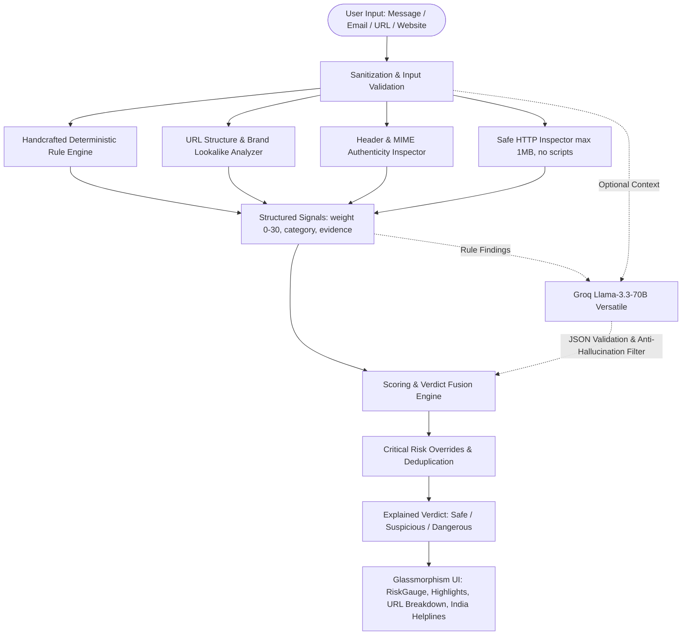

# ScamScan — Hybrid AI & Heuristic Phishing Detector

ScamScan is an intelligent, transparent scam and phishing detection system tailored for Indian financial fraud vectors and global cyber threats. It fuses transparent deterministic heuristics with fast LLM contextual reasoning powered by Groq.

## Problem Statement

Online financial cybercrime in India has skyrocketed—ranging from fake electricity disconnection threats and deceptive SBI/HDFC KYC alerts to fake lottery prizes and coercive "digital arrest" phone scams. Traditional blacklist-based filters fail against ephemeral domains and novel phrasing. Pure black-box AI often hallucinates or fails to provide concrete evidence.

ScamScan provides transparent, explainable detection:
- **Every flag has a specific evidence quote and category.**
- **The system operates rules-only if AI is offline or rate-limited.**
- **Real-time highlighting and URL structure breakdowns empower non-technical users.**

## Architecture & How It Works



## Core Features

- **4 Input Modes**: Analyze SMS/WhatsApp chat messages, raw emails with headers, standalone links, or live websites.
- **Hand-Crafted Heuristic Signals**:
  - Urgent countdowns & coercion
  - Negation-aware OTP / credential theft detection
  - Levenshtein-based brand typo-squatting & Punycode homoglyphs
  - Email authentication (SPF/DKIM/DMARC) and Reply-To mismatch
  - Deceptive form destinations and hidden iframes
- **Groq AI Integration**: Llama-3.3-70b-versatile with automatic fallback to Llama-3.1-8b-instant.
- **Anti-Hallucination Engine**: Filters out any AI-claimed evidence not present verbatim in original content.
- **Privacy-Preserving SQLite Storage**: Stores only SHA-256 hashes and 120-character truncated previews.
- **Cybersecurity Awareness Hub**: Interactive "Spot The Scam" quiz and 6 core rules of cyber defense.
- **India Cybercrime Integration**: Direct access to 1930 Helpline, cybercrime.gov.in, and Sanchar Saathi Chakshu.

## Project Structure

```
ScamScan/
├── backend/
│   ├── app/
│   │   ├── main.py
│   │   ├── config.py
│   │   ├── schemas.py
│   │   ├── routes.py
│   │   ├── scoring.py
│   │   ├── history.py
│   │   ├── analyzers/
│   │   │   ├── brands.py
│   │   │   ├── text_rules.py
│   │   │   ├── url_checks.py
│   │   │   ├── email_checks.py
│   │   │   └── website_checks.py
│   │   └── ai/
│   │       ├── prompts.py
│   │       └── groq_client.py
│   ├── tests/
│   ├── samples/
│   │   └── demo_cases.json
│   └── requirements.txt
├── frontend/
│   ├── src/
│   │   ├── App.jsx
│   │   ├── api.js
│   │   ├── components/
│   │   └── pages/
│   └── package.json
├── .env
└── README.md
```

## Quickstart Guide

### Prerequisites
- Python 3.11+
- Node.js 18+ and npm

### 1. Environment Setup

Create `.env` in the root directory:

```env
GROQ_API_KEY=your_groq_api_key_here
PORT=8000
FRONTEND_ORIGIN=http://localhost:5173
```

*(Note: ScamScan operates fully in rules-only mode if no Groq API key is provided.)*

### 2. Backend Setup & Run

```bash
cd backend
python -m venv venv
venv\Scripts\activate
pip install -r requirements.txt
uvicorn app.main:app --reload --port 8000
```

Run test suite (40 automated tests with accuracy table):

```bash
cd backend
pytest -s
```

### 3. Frontend Setup & Run

```bash
cd frontend
npm install
npm run dev
```

On Windows PowerShell:
```powershell
npm.cmd run dev
```

Open `http://localhost:5173` in your browser.

## Sample Evaluation Results

| Sample ID | Input Type | Description | Verdict | Score |
|---|---|---|---|---|
| `demo-sbi-kyc` | Message | Urgency + lookalike `.xyz` domain | Dangerous | 90 |
| `demo-power-cut` | Message | Utility disconnection threat + phone | Suspicious | 47 |
| `demo-digital-arrest` | Message | CBI arrest warrant intimidation | Suspicious | 47 |
| `demo-telegram-job` | Message | YouTube like tasks + bit.ly link | Dangerous | 60 |
| `demo-paypal-spoof` | Email | SPF/DKIM fail + Reply-To mismatch | Dangerous | 70 |
| `demo-legit-bank-otp` | Message | Bank OTP with "Do not share" warning | Looks Safe | 0 |
| `demo-official-url` | URL | Official onlinesbi.sbi portal | Looks Safe | 0 |

## Limitations

- Does not execute client-side JavaScript or simulate browser actions for dynamic Single Page Applications (SPAs).
- Static analysis relies on known brand registries and heuristics.

## Future Scope

- **Chrome / Edge Extension**: Real-time warning badge for suspicious URLs before navigation.
- **Multimodal OCR**: Screenshot and QR code scanning via Groq Vision models (`llama-3.2-11b-vision-preview`).
- **Automated WhatsApp Bot**: Forward suspicious messages directly to a WhatsApp hotline for automated triage.
- **WHOIS & Domain Age**: Live WHOIS lookup to calculate domain registration age.
- **Crowdsourced Threat Intelligence**: Community scam flagging and verification.
